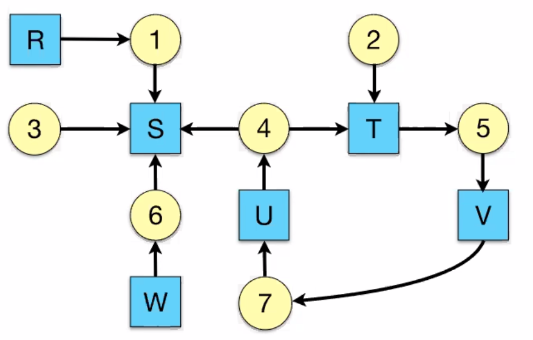

Deadlock
========

- Resources
- why do deadlocks occur?

Resource
--------

- something a process or thread wants
- e.g.
    - printer
    - semaphore/lock
    - memory
    - database table
- processes need to access resources in a reasonable order
- 2 types:
    - preemptable: can be taken away with no ill effects
    - nonpreemptable: will cause the process to fail if taken away

- sequence of events required to use:
    - request
    - use
    - release
- can't use the resource if request is denied
    - requesting process has options:
        - block
        - continue without it
        - fail with error code

Occurances
----------

Deadlocks occur when processes are granted exclusive access to devices or software constructs, and each deadlocked
process needs a resource held by another deadlocked process

4 conditions for deadlock:

- mutual exclusion
    - each resource is assigned to at most one process
- hold and wait
    - a process holding resources can request more resources
- no preemption
    - previously granted resources cannot be forcibly taken away
- circular wait
    - there must be a chain of 2 or more processes where each is waiting for a resource held by the next member of the chain

We can model them using resource allocation graphs - draw an arrow from a resource to a process if the process hold it,
draw an arrow from the process to the resource if it wants it

We get a deadlock if there is a circle in the graph

Dealing With It
---------------

OS solutions:

- do nothing: the ostrich algorithm
    - reasonable if it's rare and high cost to prevent
- detect deadlock and recover from it
    - use a graph to detect deadlocks
    - kill a process in the deadlock circle
- dynamically avoid deadlock
    - careful resource allocation
- prevent deadlock
    - remove at least 1 of the 4 conditions

In this image, process 3 is not deadlocked, but process 2 is deadlocked

Recovery
^^^^^^^^

- preemption
    - take a resource from another process (depends on nature of resource/process)
- rollback
    - checkpoint a process periodically
    - use saved state to restart process if in deadlock
    - may present a problem if the process affects a lot of external things
- kill process
    - kill one in the deadlock cycle
    - other process can loot its corpse
    - try and choose a process that can be rerun from the start - pick one that hasn't run too far already

Prevention
^^^^^^^^^^
We can prevent deadlock by removing one of the conditions:

Eliminating mutex
"""""""""""""""""

- some devices can be spooled/queued
    - e.g. printer - only the printer daemon uses printer resource
    - eliminates deadlock for printer
- not all devices though
- principle:
    - avoid assigning resource when not absolutely necessary
    - as few processes as possible actually claim resource

Attacking Hold/Wait
"""""""""""""""""""

- require processes to request resources before starting
    - a process never has to wait for what it needs
- can add problems
    - a process may not know the resources it requires
    - also ties up resources other processes could be using
- variation: a process must give up all resources before making a new request
    - process is then granted all prior resources as well as new ones
    - problem: what if someone grabs the resources in the meantime?

Attacking no-preemption
"""""""""""""""""""""""

- just forcibly take away resources
- No one does this apparently

Attacking circular wait
"""""""""""""""""""""""

- assign an order to resources
- always require resources in numerical order
    - need not acquire them all at once
- circular wait is prevented
    - a process holding resource *n* can't wait for resource *m* if m < n
    - no way to complete a cycle
        - place processes above the highest resource they hold and below any they require
        - all arrows point up

Livelock
--------
Sometimes, processes can still run, but not make progress

- e.g. 2 processes want to use resourves A and B
    - P0 gets A, P1 gets B
    - they realize that they will deadlock if they continue
    - P0 drops A, P1 drops B
    - P0 gets B, P1 gets A
    - this continues...
- e.g. ethernet transmission collisions
    - multiple processes retrying at the exact same time...

