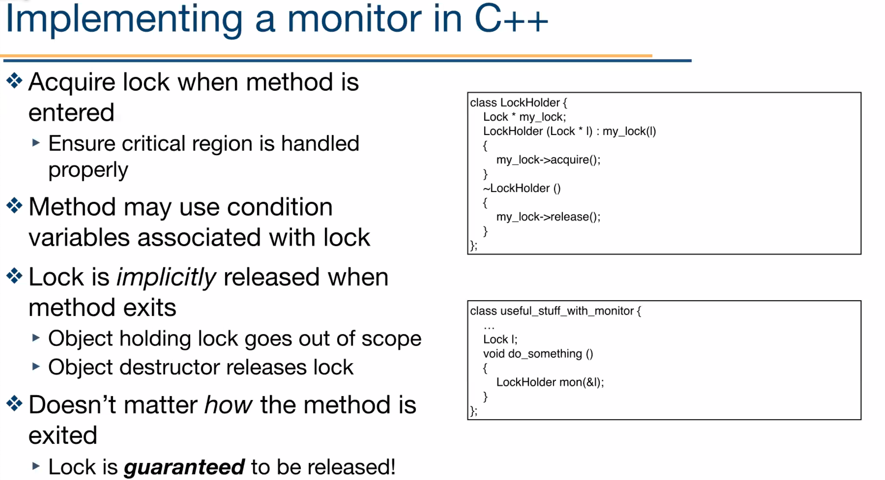

Syncronization
==============

Take, for example, inter-thread communication: each thread operates sequentially, and everything is fine
until threads want to share data.

We can implement this with a producer/consumer queue - but what if the buffer is full on produce or empty on consume?

One thing we can do is have the producer block until the queue is not full and consumer block until the queue is not
empty - but there's a problem.

Race Conditions
---------------

- cooperating threads share memory
- both may r/w the shared memory
- but, we can't guarantee that read followed by write is atomic

So, we need to ensure certain operations are atomic that are critical (*critical regions*)

- Critical regions provide mutual exclusion and help fix race conditions
- 4 conditions must hold:
    - no 2 threads may simultaneously be in a critical region
    - no assumptions may be made about speeds or number of cpus
    - no thread running outside its critical region may block another thread
    - a thread may not wait forever to enter its critical region

Spin Lock
^^^^^^^^^

One approach is to use a single shared variable to keep track of whose turn it is, and busy wait until it's
a given thread's turn.

This is called a spin lock - the waiting thread spins in a tight loop reading the turn variable.

This avoids race conditions, but it doesn't satisfy criterion 3 for critical regions: each thread has
to alternate, instead of the next available thread that needs to run the critical region doing it.

Busy Waiting
^^^^^^^^^^^^

.. code-block:: c

    #define FALSE 0
    #define TRUE 1
    #define N 2
    uint32_t turn;
    uint32_t interested[N];
    void enter_region(uint32_t thread) {
        uint32_t other = 1 - thread;
        interested[thread] = TRUE;
        turn = thread;                  // my turn to wait
        // wait while the other thread runs
        while (turn == thread && interested[other] == TRUE) {}
    }

    void leave_region(uint32_t thread) {
        interested[thread] = FALSE;
    }

Bakery Algorithm
^^^^^^^^^^^^^^^^
Multiple-producer syncronization

Notation:

- ``<<<`` is lexographical order on (ticket_number, thread_id)
- ``(a, b) <<< (c, d)`` if ``(a < c) or ((a == c) and (b < d))``
- :math:`\max(a_0, a_1, ..., a_{n-1})` is a number *k* s.t. :math:`k \geq a_i` for all *i*

.. code-block:: c

    uint32_t n;             // number of threads
    uint32_t choosing[n];   // initialized to 0
    uint32_t number[n];     // initialized to 0

    while (1) {
        // get a ticket number higher than anyone else's, using single writer property
        choosing[i] = 1;    // where i is the current thread #
        number[i] = max(number[0]..number[n-1]) + 1
        choosing[i] = 0;
        for (uint32_t j = 0; j < n; j++) {
            // wait while j is choosing a number
            // important in case max() chose the same number, but i ran before j could write to mem
            while (choosing[j]) {}
            // wait while j wants to enter and j <<< i
            while ((number[j] != 0) && ((number[j] < number[i]) || ((number[j] == number[i]) && (j < i)))) {}
        }
        // critical section goes here
        number[i] = 0;
        // rest of code
    }

Hardware Sync
-------------

Software methods discussed above work, but...

- may be complex
- require busy waiting, wasting CPU time

- several hardware methods (typically in CPU ISA)
    - test and set: read and write in a single instruction
    - atomic swap: swap reg and mem in 1 instruction
- software only solution: turn off interrupts, so thread won't be switched out unless it asks to be suspended
- x86 supports compare-and-swap: most common solution

Variable Lock
^^^^^^^^^^^^^

- single shared variable lock
- 2 versions: test and set, swap
- works for any number of threads
- still requires busy waiting, but simpler
- possible problem with requirements: non-concurrent code can lead to unbounded waiting

TestAndSet:

.. code-block:: c

    int32_t lock = 0;
    while (1) {
        while (TestAndSet(lock)) {}  // test and set writes 1 to lock and returns what was there in 1 operation
        // critical section
        lock = 0;
        // rest of code
    }

swap:

.. code-block:: c

    int32_t lock = 0;
    while (1) {
        while (Swap(lock, 1)) {}  // swaps 1 with the lock and returns what was there
        // critical section
        lock = 0;
        // rest of code
    }

**Problems**

- these waste CPU time
- priority inversion (higher priority thread waits for lower)
    - e.g. if P1 is waiting on P3's lock, but P2 is running since it's higher priority

Semaphores
^^^^^^^^^^
Semaphores are a syncronization mechanism that doesn't require busy waiting during the entire critical section

- Semaphore ``S`` accessed by 2 *atomic* operations
    - ``Down(S)``: ``while (S <= 0) {}; S = S-1;`` aka ``P()``
        - blocks until the value of the semaphore reaches 1 or higher, and decrement it
    - ``Up(S)``: ``S = S+1;`` aka ``V()``
        - increments the semaphore by 1
- modify implementation to eliminate busy wait from Down()

**Implementation**

- Assume 2 existing operations:
    - ``Sleep()``: suspends current thread
    - ``Wakeup(T)``: allows thread T to continue execution
- Semaphore is a class
    - tracks value of semaphore
    - keeps a list of threads waiting for the semaphore
- operations still atomic

.. code-block:: cpp

    class Semaphore {
        int32_t value;
        ThreadList tl;
        void down();
        void up();
    }

    Semaphore::down() {
        value -= 1;
        if (value < 0) {
            // add this thread to tl
            Sleep();
        }
    }

    Semaphore::up() {
        Thread *T;
        value += 1;
        if (value <= 0) {
            // remove a thread T from tl
            Wakeup(T);
        }
    }

**General Sync**

- e.g. We want to execute B in T1 only after A executes in T0
    - use a semaphore initialized to 0
    - use ``up()`` to notify T1 at the appropriate time
- this is called a **rendezvous**

.. code-block:: cpp

    // flag initialized to 0
    Semaphore flag;

    /* --- thread T0 --- */
    ...
    // execute code for A
    flag.up();

    /* --- thread T1 --- */
    ...
    flag.down();
    // execute code for B

Types
"""""

- counting semaphores
    - value can range over an unrestricted range
- binary semaphore
    - only 2 values available
    - value 1 means semaphore is available
    - value 0 means a thread has acquired the semaphore

Monitor
^^^^^^^

- another kind of high-level sync primitive
    - one monitor has multiple entry points
    - only 1 thread may be in the monitor at any time
    - enforces mutual exclusion: better at avoiding programming errors
- provided by high-level language
    - variables belonging to monitor are protected from simultaneous access
    - procedures in monitor are guaranteed to have mutual exclusion
- monitor implementation
    - language/compiler handles implementation
    - can be implemented using semaphores

Example
"""""""

- not real code!
- provides the following features:
    - variables foo, bar, and arr are accessible only by func1 and func2
    - only 1 thread can be executing func1 or func2 at a time
    - ...

.. code-block:: cpp

    monitor mon {
        int32_t foo;
        int32_t bar;
        double arr[100];
        void func1(...) {}
        void func2(...) {}
        void mon() {}  // init code
    }

- Problem: how can a thread wait inside a monitor?
    - e.g. if a thread in monitor A wants to enter monitor B, monitor A is now blocked
    - solution: use a condition variable
- condition variables support 2 operations
    - ``Wait()``: suspend this thread until signaled
    - ``Signal()``: wait up **exactly one** thread waiting on this condition variable
        - if no thread is waiting, no effect
        - signals on condition variables aren't "saved up"
- condition variables are only usable within monitors

- monitors require native language support
- instead, many languages provide monitor support using special data types and procedures
- e.g. lock
    - acquiring a lock is like entering a monitor
    - releasing a lock is like leaving a monitor
- condition variable usage
    - each condition variable is associated with exactly one lock
    - lock must be held to use condition variable
    - waiting on a condition variable releases the lock implicitly
    - returning from ``Wait()`` on a condition variable reacquires the lock

Barriers
^^^^^^^^

- used for syncronizing multiple threads
- threads wait at a "barrier" until all in the group arrive
- after all have arrived, all threads can proceed
- may be implemented using locks and condition variables

.. code-block:: cpp

    Barrier b; // contains 2 semaphores
    b.bsem.value = 0; // for the barrier
    b.mutex.value = 1; // for mutual exclusion
    b.waiting = 0;
    b.maxthread = n;

    void HitBarrier(Barrier *b) {
        SemDown(&b->mutex);
        if (++b->waiting >= b->maxthread) {  // if everyone is waiting now, loop and release everyone
            while (--b->waiting > 0) {
                SemUp(&b->bsem);
            }
            SemUp(&b->mutex);
        } else {  // otherwise I start waiting
            SemUp(&b->mutex);
            SemDown(&b->bsem);
        }
    }